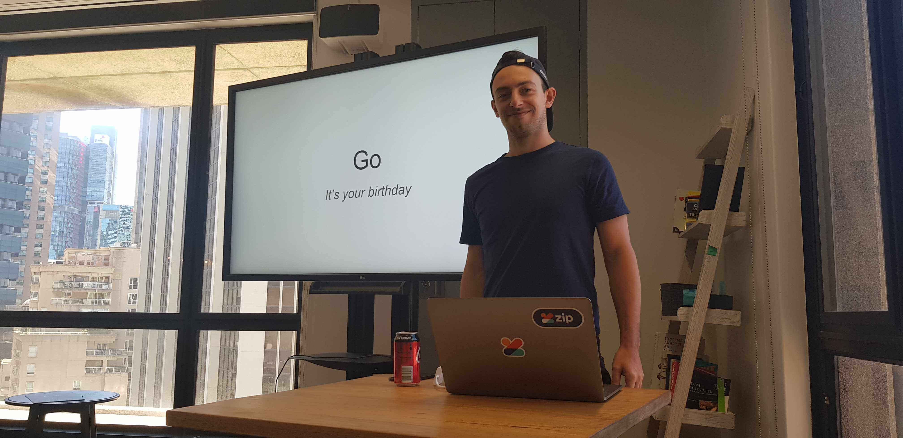
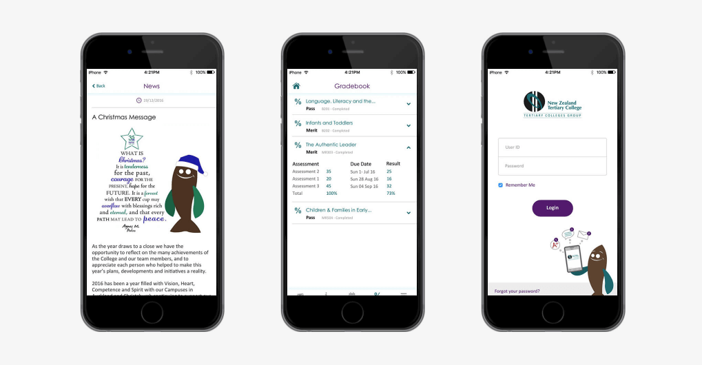

<p align="center"></p>
<p align="center"><b>David Al</b></p>
<p align="center"><i>Technology enthusiast and mad scientist</i></p>
<p align="center">Senior Full Stack Software Engineer<br>Sydney, Australia</p>

<h1>Contents</h1>

- [Introduction](#introduction)
- [Technologies](#technologies)
- [Tutorials](#tutorials)
  - [Endorsements](#endorsements)
- [Presentations](#presentations)
  - [Brown Bag Sessions](#brown-bag-sessions)
  - [AWS Ninjas](#aws-ninjas)
- [Articles](#articles)
  - [SOLID TypeScript](#solid-typescript)
- [YouTube](#youtube)
  - [API Design with Go](#api-design-with-go)
  - [Front End Tutorials](#front-end-tutorials)
  - [Go API using an SQL database (5 part series)](#go-api-using-an-sql-database-5-part-series)
  - [Channel](#channel)
- [Employment Experience](#employment-experience)
  - [Rokt](#rokt)
    - [Overview](#overview)
    - [Endorsements](#endorsements-1)
  - [Pay Later Travel](#pay-later-travel)
    - [Endorsements](#endorsements-2)
  - [Zip](#zip)
    - [Technologies](#technologies-1)
    - [Overview](#overview-1)
    - [Angular vs Vue](#angular-vs-vue)
    - [Angular Component Library (Project Maple)](#angular-component-library-project-maple)
    - [Website rewrite](#website-rewrite)
    - [Authentication and user unification project](#authentication-and-user-unification-project)
      - [OAuth2, OpenID Connect, Cognito, IdentityServer4](#oauth2-openid-connect-cognito-identityserver4)
      - [Development](#development)
    - [Gift Cards](#gift-cards)
    - [Endorsements](#endorsements-3)
  - [Marshall Installs](#marshall-installs)
    - [Technologies](#technologies-2)
    - [Overview](#overview-2)
    - [Specifications](#specifications)
      - [Progressive Web Application](#progressive-web-application)
      - [Bookings](#bookings)
      - [Runs](#runs)
      - [Administration staff](#administration-staff)
      - [Drivers](#drivers)
      - [Retail Staff](#retail-staff)
      - [End Customers](#end-customers)
    - [Architecture](#architecture)
    - [Conclusions](#conclusions)
    - [Endorsements](#endorsements-4)
  - [BrownPaperBag](#brownpaperbag)
    - [Overview](#overview-3)
    - [Textile Recycling Centre](#textile-recycling-centre)
      - [Technologies](#technologies-3)
      - [Overview](#overview-4)
      - [Architecture](#architecture-1)
      - [Development](#development-1)
    - [New Zealand Tertiary College](#new-zealand-tertiary-college)
      - [Links](#links)
      - [Technologies](#technologies-4)
      - [Overview](#overview-5)
      - [Architecture](#architecture-2)
    - [Endorsements](#endorsements-5)
  - [Primary Security](#primary-security)
  - [OzKiwi](#ozkiwi)
    - [Links](#links-1)
    - [Technologies](#technologies-5)
    - [Overview](#overview-6)
- [MISC](#misc)
  - [Computer Clearance Centre (2013)](#computer-clearance-centre-2013)
    - [Endorsements](#endorsements-6)
  - [On Call Computer Repairs (2012 - 2014)](#on-call-computer-repairs-2012---2014)
    - [Endorsements](#endorsements-7)
  - [PSP Homebrew (2007)](#psp-homebrew-2007)
- [Endorsements (All)](#endorsements-all)

# Introduction

Software and technology are my passions. 

Over the last decade I have spent an inordinate amount of time immersed in software challenges, contributing to open source projects and learning technologies.

I get a lot of enjoyment from sharing new ideas and gaining perspective from the experiences of others.

I have an unyieldingly enthusiastic approach to problem solving. I will read documentation (and Stack Overflow), write automated tests and persist with trial and error until the desired result is attained.

Generally I have an entrepreneurial mind, operating personal ventures and attempting start ups. 

I really enjoy greenfield projects where I have the capacity to construct an entire solution from the infrastructure to the team.

My roles have taken me through many disciplines. When working for Zip Co Limited I spent 8 months heavily involved in the development of their security and authentication service.

My role with Rokt involves interesting challenges involving the secure transmission of personally identifying information across multiple iframes.

Whatever the challenge, I enjoy sharing what I learn with colleagues, hosting presentations or writing internal articles.

</br>
<p align="center"></p>
<p align="center"><i>My personal philosophy is that it’s not a question of if you’re are capable of achieving something, <br>it’s a question of how long it'll take you to learn</i></p>
</br>

I have a strong foundation in front end development with TypeScript is my preferred JavaScript variant.

I have extensive experience with back end services written in Node, and commercial experience with Go (Golang).

I am capable of establishing the development infrastructure necessary to make developing JavaScript based projects complete with the creation of an npm repository, compilers (webpack, rollup, TypeScript), testing libraries.

I have the plethora of experience working with authentication, having implemented an entire OAuth OpenID server and associated clients for Zip Co. 

In terms of infrastructure, I am familiar with the management of Linux servers and managing DNS records though I prefer to delegate those responsibilities to provider with managed services - like AWS.

A common pattern I use to deploy web services is placing a CloudFront distribution in front of an S3 bucket, using Route53 to point a domain to that web service.

If I need a server, I would consider lambda functions and DynamoDB before more involved alternatives.

# Technologies

| Front End | Back End | Devops |
| -- | -- | -- |
| React | Node | AWS |
| Redux | Go (Golang) | Digital Ocean |
| Angular | Postgres | Git |
| TypeScript | MongoDB | CI/CD |
| JavaScript | Aurora | Linux |
| REST | OAuth2 OpenID Client | Docker |
| WebSockets | OAuth2 OpenID Server | Nginx |
| Webpack | | AWS Cognito | 
| HTML | | Auth0 |
| CSS/SCSS |
| OAuth2 OpenID Client |

<br>

<br>

# Tutorials

I held software development tutorials with the intention of helping aspiring developers enter the industry with relevant skills.

The tutorials started at the absolute basics. Simple control flow such as if statements and for loops. Over time bringing these abstract concepts together to create complete applications, presented using HTML and CSS.

It was an incredible challenge as I had to learn ways to communicate concepts that I was familiar with into the thinking space of intelligent people who had never had exposure to them. 

It challenged a lot of my preconceptions, where I had previously naively assumed a lot of the knowledge in computer science was simple and common, I learned that it can be a challenge to grasp.

Overall, the experience of teaching was massively rewarding and I continued the pursuit through work presentations and online, where I have established a YouTube channel that provides free tutorials.

<p align="center"></p>
<p align="center"><i>The porcelain rhino held particular significance to us</i></p>

Every one of my students went on to enter the IT industry. I feel proud to think that in some way, the tutorials we did may have served to contribute to their paths and achievements.

## Endorsements

[Lauren Judge - Software Developer]()

# Presentations

Sharing knowledge is something which I really enjoy. Hosting presentations on topics I am researching at the time, or on a topic I am working on.

Using the presentations as a forum where other engineers can engage and share their experiences really helps me shape my understanding, as well as share that understanding amongst the group.

## Brown Bag Sessions

In my professional career, I have held brown bag sessions on a multitude of topics. 

These topics range from front end specific concepts like the WC3 custom element specification to back end technology introductions like using Google's Go language.

</br>
<p align="center"></p>
</br>

## AWS Ninjas

In an effort to motivate myself and my colleagues to complete our AWS certificate exams, I organised a weekly meeting we called the "AWS Ninjas".

We would go over a new AWS topic each week with the end goal being the successful certification of the staff members.


</br>
<p align="center"></p>
<p align="center"><i>AWS Ninjas</i></p>
</br>

# Articles

I am really passionate about quality software engineering practices. 

I will often read books and gain inspiration from the understanding of different paradigms. 

While I feel I am personally not at a level where I am able to write a book on anything significant, I feel confident enough to write articles which digest concepts others have uncovered, applying them to the context of the technologies I use.

## SOLID TypeScript

After approaching the Go language, I was introduced to an entire era of software engineering concepts I previously hadn't been exposed to. 

Go is essentially C with a runtime that provides garbage collection and task scheduling. This allows it to introduce novel methods of handling concurrency, high performance and minimal syntax.

One thing that stuck out to me was the community's attitude of not rushing perfection, instead preferring contribution through careful consideration.

The language features minimal keywords, the community leaning on best practices through the use of engineering principles, often personified as proverbs.

Proverbs such as:

```
Accept interfaces, return structs
```

Or 

```
Don't communicate by sharing memory, share memory by communicating
```

This got me wondering where these proverbs originated so I began to study about software design principles. 

SOLID design principles interested me so I wrote an article about where I apply the concepts to TypeScript. 

TypeScript being a superset of JavaScript which grants developers the ability to include type information to standard JavaScript code.

[Link to article](https://github.com/alshdavid-edu/docs/blob/master/solid-typescript/readme.md)

# YouTube

I have recently started recording videos for YouTube and writing articles on Medium. My goal is to share knowledge and get people interested in the technologies I enjoy.

I am still learning the ropes to this. I need to get a better microphone, perhaps a webcam and learn how to properly segment the videos so they are more easily digestible.

## API Design with Go

In this video I walk through setting up an API using Go and the HTTP router Gin. I get into the testing of handlers and packages, as well as some information on how to use interfaces to simplify testing.


[Link To Video](https://www.youtube.com/watch?v=LOn1GUsjOF4)
<br>
<p align="center"></p>
<br>

## Front End Tutorials

In this video I set up an Angular client on an existing http server that is using Go and the web framework Gin. I cover some simple ideas like two way data-binding, structural directives and modules.

[Link To Video](https://youtu.be/pHRHJCYBqxw)
<br>
<p align="center"></p>
<br>

## Go API using an SQL database (5 part series)

This video series covers creating a web API using GO and persisting the data inside of an SQL based database - in this case SQLite.

We create a "news feed", not unlike a Facebook wall and communicate to it using JavaScript.

We dive into software design concepts such as "Package Oriented Design", and thoroughly test our service.

[Series Link](https://www.youtube.com/watch?v=Q4XpDziGH0E&list=PLwP3sv2nn4dKz84uiXHcjvsx37tKoducb)

<br>
<p align="center"></p>
<br>

## Channel

To view the rest of the videos, check out my channel directly:

[YouTube Channel](https://www.youtube.com/channel/UCUBQwTd4Xx8U0V5nfuH6Y5Q/videos?view_as=subscriber)

# Employment Experience

## Rokt


[rokt.com](https://rokt.com)<br>
Sydney, Australia<br>
Senior Software Engineer<br>
2019 - 2020<br>

### Overview

Rokt is a marketing technology company. 

My work is focused on the development of their integration technology, which enables the display of their "widget" and the secure transmission of private personally identifiable information on the pages of partners

### Endorsements

[James Wilson - Chief Technical Officer]()

## Pay Later Travel


[paylatertravel.com.au](https://paylatertravel.com.au/)<br>
Sydney, Australia<br>
Senior Software Engineer / Consultant (Contract)<br>
2019<br>

### Endorsements

[Farouk Ismail - Chief Technical Officer](references/farouk-ismail-pay-later-travel.pdf)


## Zip


[zip.co](https://zip.co/)<br>
Sydney, Australia<br>
Senior Software Engineer<br>
2017 - 2019<br>

### Technologies
  - [Angular 8](https://angular.io/)
  - [TypeScript](https://www.typescriptlang.org/)
  - [Go (Golang)](https://golang.org/)
  - [Node](https://nodejs.org)
  - [C# Dotnet](https://docs.microsoft.com/en-us/dotnet/csharp/programming-guide/)
  - [ASP.net Core](https://docs.microsoft.com/en-us/aspnet/core/?view=aspnetcore-3.1)
  - [OAuth2](https://oauth.net/2/)
  - [OpenID Connect](https://openid.net/connect/)
  - [IdentityServer4](http://docs.identityserver.io/en/latest/)
  - [AWS Cognito](https://aws.amazon.com/cognito/)
  - [Microsoft SQL](https://www.microsoft.com/en-gb/sql-server)
  - [Docker](https://www.docker.com)

### Overview

Zip Co Limited is an Australian financial technology company founded in 2013 and is headquartered in Sydney. It currently has around 10,000 retail partners and 1,200,000 customers in Australia.

I joined Zip in late 2017 as a software engineer. Zip was a company that prided itself on creative freedom, agility and providing every employee the opportunity to share ideas. 

This culture of innovation provided me with an incredible platform for personal and professional development.

I fostered many positive relationships at Zip, developed my love for knowledge sharing, explored many new concepts, diving deeply into security and infrastructure.

Zip held many events, one of which was a "hackathon". This event involved staff organising themselves into teams, the goal being to create the next big idea.

[I led the engineering aspects of project which enabled customers the ability to use their Zip balance to purchase gift cards.](https://zip.co/giftcards/)

Within 3 months of publishing this service to the public, Zip became the largest gift card retailer in Australia, holding a lead of 20% against the nearest competitor.

### Angular vs Vue

Being a start up Zip built it's original platform quickly and cost effectively. As the company grew, so to did the need for a system that was more agile and scalable.

When I started at Zip, we were in the early stages of discussing what that upgrade would look like. Ideas were being thrown around surrounding which technologies should be chosen.

I was hired as a front end engineer, so I turned my focus on contributing to the discussion in the domain I occupied.

At the time, the legacy system was written in AngularJS, the older form of Angular which bared little resemblance to the new Angular. 

The technology leading as it's potential replacement was Vue. Having some experience with Vue, I felt the tool wasn't mature enough to trust in an enterprise setting. 

THe Zip product would require a lot of tools, utilities and features which I felt would have a higher likelihood of existing inside the Angular ecosystem over the Vue ecosystem.

To illustrate my point, I prepared multiple documents which I organised and presented to the engineering leadership. 

Here is one of the documents I prepared [vue-vs-angular.pdf](documents/vue-vs-angular.pdf)

The leadership decided that we should go with Angular, and that lead me onto my next project - a UI component library.

### Angular Component Library (Project Maple)

Soon after Zip officially adopted the use of the latest Angular as its web framework of choice, I began work on a UI component library.

A UI component library is essentially a collection of discrete elements. Developers select components to construct a user interface, this ensures consistency and centralised source of truth for UI features. 

Examples of such elements are buttons, input fields, toast messages, alerts.

Each element accepts an external configuration which gives the "component" the information it needs to describe itself on the user's interface (such as colour, boldness, background colour, etc)

<br>
<p align="center"></p>
<p align="center"><i>UI Component (Maple) live demo</i></p>
<br>

The reason I wanted to create a component library was to ensure homogeny in experience between the different areas in the customer facing application and improve development time of features. 

It was expected that this component library would be used by multiple teams in multiple projects, as such, they needed to be stored and installed from a central repository.

JavaScript-based applications have a package management solution known as npm. I set up and configured a private npm repository for Zip to cater to internal use. 

I used the newly created npm repository to distribute the component library and other internal JavaScript based tools.

### Website rewrite

### Authentication and user unification project

Zip was in the process of releasing a native mobile application for Android and iOS, the problem was in the way the existing service was separated. 

Zip currently provides two finance products, ZipMoney and ZipPay. 

Originally, Zip was known as ZipMoney and only offered ZipMoney, which is a finance product which facilitated loans larger than a certain threshold. 

The then ZipMoney wanted to release a product which targeted loans lower than the ZipMoney threshold and so they introduced the ZipPay product. 

To simplify the development process and reduce development time, ZipPay was simply a redeployment of the ZipMoney monolith with adjusted configurations. 

The ZipPay service was hosted on separate servers and domains. Essentially, two entirely separate services, united only in branding.

This worked fantastically for a number of years, but with the native app on the horizon, the two service model didn't make sense in the context of the single entry point the native app provided. 

<br>
<p align="center"></p>
<p align="center"><i>Architecture of starting point</i></p>
<br>

Zip required uniting the two separate user stores into a single user store. 

The existing ZipPay and ZipMoney services would verify against this new service to authenticate user actions. 

To do this there were two challenges, the implementation of an SSO technology and the migration of millions of records.

Originally, if a user wanted to use both services, they were required to sign up twice using the same email. 

The original services did not enforce things like email verification, they also allowed users to sign up using Facebook which would often have users using email addresses which were different to their own.

Due to not having access to user credentials, simply mass migrating user details to a new user store would result in prompting every user to change their password at login.

We wanted to introduce a minimally invasive experience to users and there for we determined an on-demand migration was required. 


Using an on-demand approach gave us momentary access to their credentials upon login. This access triggered migration logic intended to identify a possible corresponding account in the alternate service. 

Once identified, the accounts would be unified by creating a user in the new authentication system which would relationally linked to the account information stored in the services.

This presented many challenges in the number of permutations in the migration logic.

<i>For example; a user might have an account in ZipMoney and ZipPay, where their ZipMoney email was verified, their ZipPay email was not and they were logging in using their ZipPay account where the entered password does not match their ZipMoney password</i>

<br>
<p align="center"></p>
<p align="center"><i>Architecture of end point</i></p>
<br>

Requests attempting to authenticate using the legacy systems would be redirected to the new central authentication system. 

This ensured that migration logic could be enacted on-demand as a user logged in. The new authentication service would make requests to a private admin API on the ZipMoney and ZipPay services in order to determine account unification outcomes.

The mobile app would target an API on the central authentication service which would grant access through the use of a security token to the account information stored in the ZipMoney and ZipPay services

#### OAuth2, OpenID Connect, Cognito, IdentityServer4

#### Development

### Gift Cards

### Endorsements

[Darren Smith - Product Manager]()<br>
[Zarhayda Tun - Software Engineer]()<br>
[Malcolm Fitzgerald - Chief Technical Officer]()<br>
[Brent Mckendrick - Head of Engineering](references/brent-mkendrick-head-of-engineering.pdf)

## Marshall Installs


[marshallinstalls.co.nz](http://www.marshallinstalls.co.nz/)<br>
Auckland, New Zealand<br>
Software Developer<br>
2017<br>

### Technologies
  - [Angular 8](https://angular.io/)
  - [TypeScript](https://www.typescriptlang.org/)
  - [WebSockets](https://developer.mozilla.org/en-US/docs/Web/API/WebSockets_API)
  - [Node](https://nodejs.org)
  - [MongoDB](https://www.mongodb.com)
  - [Docker](https://www.docker.com)
  
### Overview

Marshall Installs is a company that specialises in the delivery and installation of goods purchased from retailers around New Zealand. The list of retailers features popular brands like Harvey Norman.

I was contracted to develop a delivery management service to help the company simplify their administration process and improve the quality of service provided to their customers.

This project was unique in that I sourced the contract myself, consulted the owner of their requirements and built the entire service from scratch.

I functioned as the project manager, consultant, designer, front and back end developer, devops and continue to take small contracts to maintain the software. I employed a friend to help with the work load of the back end development.

### Specifications

There are 4 audiences for this service 

 - `administration staff`
 - `drivers` 
 - `retail employees` 
 - `end customers`

#### Progressive Web Application

The service is available as an installable [progressive web application](https://developer.mozilla.org/en-US/docs/Web/Progressive_web_apps) for mobile devices and desktop computers. The intention with choosing this application style is that the service behaves as though it were written natively for the platform.

The application is fully responsive so it behaves well in both desktop and mobile contexts.

<br>
<p align="center"></p>
<p align="center"><i>Desktop application accessible via shortcut</i></p>
<br>

<br>
<p align="center"></p>
<p align="center"><i>Mobile app accessible via homescreen icon</i></p>
<br>

#### Bookings

The core component of the Marshall Installs service surrounds the administration of "bookings".

Bookings represent groupings of work such as deliveries and installation jobs. 

Bookings hold information about the job including the customer details, references and status updates associated with that booking.

A booking's status is derived from the status assigned in its last status update. Status updates can either be assigned manually or be the result of an automatic status update (such as `in-transit` when a job is assigned to a run).

Bookings are updated across all clients in real time, this is achieved by pushing events to clients using WebSockets.

<br>
<p align="center"></p>
<p align="center"><i>Booking overview page</i></p>
<br>

#### Runs

Runs are the association of bookings with drivers. 

A run can be thought of as a "truck" which is loaded with "jobs".

Once a run is assigned to a driver(s) they are able to see the bookings inside that run and have the authority to update them. 

<br>
<p align="center"></p>
<p align="center"><i>Administrator manipulating runs</i></p>
<br>

#### Administration staff

The primary purpose of administration staff is to maintain bookings and runs. 

Administration staff can create, modify, query and print bookings.

Administration staff also assign drivers to runs, which results in the bookings queued in that run to be visible to those drivers when they log in.

Administration staff use a simple drag/drop interface to add and organise bookings inside runs.

#### Drivers

Drivers are staff of Marshall Installs who are responsible for the physical delivery of goods. 

Drivers must drive to a depot to pick up stock then deliver it to a customer's location where they may be required to perform additional jobs (such as installation of the new unit or removal of an existing unit).

<br>
<p align="center"></p>
<p align="center"><i>Mobile app view for drivers to update job statuses</i></p>
<br>

Through this process, the driver must manually add status updates to the booking indicating at what stage of the delivery that booking is.

The driver can initiate status updates manually, however they can also have status updates pushed automatically. 

When a new bookings is created, it will enter the system with the status of `pending`. 

When an administration staff member assigns that booking to a run (truck), a status is automatically pushed to the booking indicating that it currently `assigned`.

Once a driver picks the item up and begins their delivery of it, the driver manually pushes a status of `transit` to that booking.

Once the booking is completed, the driver pushes a completion status ranging from `complete` to `canceled`.

Each status update can be optionally decorated with a comment and/or photos uploaded or captured by the driver's camera.

#### Retail Staff

Retail staff are the employees of companies which contract Marshall Installs to conduct deliveries and installations.
 
Retail staff are expected to use their logins to manage and view the current status of their bookings. 

To create a retail staff account, Marshall Installs administration staff must use or create a "`company`", manually creating retail staff accounts which are associated with that company. 

The retail staff  are able to administer the bookings of other retail staff members of the same company, but cannot access information of other companies.

#### End Customers

End customers are a category created to facilitate for the self-service of booking information. 

End customers have no authentication whatsoever, but can access their single booking online through a URL which includes a generated token.

This generated token is available as a QR code on the page that is printed out as a result of a newly created booking


<br>
<p align="center"></p>
<p align="center"><i>Booking print page <br>(given to customer)</i></p>
<br>

### Architecture

The Marshall Installs project relies heavily on infrastructure managed by Amazon's Web Services. 

There are two git repositories, one for the client and one for the server.

Code deployment and testing is completely automated and based off a pipeline process triggered by changes to the master branch of the respective git repository.

I am the only one with the authority to merge into master and access to AWS resources. 

Automation removes the need to interact with AWS infrastructure directly, however if required, permission is controlled through IAM roles.

<br>
<p align="center"></p>
<p align="center"><i>Amazon Web Services infrastructure map</i></p>
<br>

In the above diagram, the CDN acts both as a content cache and also a path router.

AWS's CloudFront is configured with a proxy table which has the following rules:

| Rule | Destination |
|--|--|
|`/api/*`| Web server (node.js) |
|`/assets/*`| S3 bucket holding images/assets |
|`/*`| S3 bucket holding web application artifacts |

I am using a very primitive method of managing the services on the EC2 instance.

When there is an update to the master branch of the API, inside the pipeline for that repo a new docker image is created and pushed to Amazon's private Docker image registry (ECR). 

The pipeline will then tell the EC2 instance to rebuild the current docker-compose configuration, pulling the newly pushed latest image from ECR.

The limitations here are that the EC2 instance may experience down time between updates and doesn't use any sort of red-to-green deployment methods, additional horizontal compute resources aren't automatically provisioned with an increase in load, and the EC2 instance must be maintained manually (security updates and such).

I went this route because it was more cost effective and the workload isn't large enough to warrant a more elaborate auto-scaling solution.

I am using Amazon's new A1 instance type, which is an ARM based instance. Small adjustments had to be made to accommodate the instruction set - mainly, compiling my docker images to work on ARM based machines.

### Conclusions

Working on the Marshall Installs project has been an incredible experience. I feel very lucky to have been given the opportunity to develop it and extremely proud that it has been such a reliable service.

Carl, the owner of Marshall Installs, is happy with the results and frequently contracts me to build improvements.

### Endorsements

[Carl Marshall - Chief Executive Officer]()<br>

## BrownPaperBag


[brownpaperbag.co.nz](https://brownpaperbag.co.nz)<br>
Auckland, New Zealand<br>
Software Developer<br>
2015 - 2017<br>

### Overview

BrownPaperBag is a software development studio located in Auckland which focuses on the creation of web sites and mobile apps for businesses in and around New Zealand.

My work for BrownPaperBag was as a software developer, building many unique greenfield projects. I was initially hired as a front end developer due to my prior demonstrated skills in front end however my role transitioned to full stack as my skill set expanded.

Upon starting employment, my experience was limited to simple HTML and CSS knowledge. I hadn't yet come into contact with CSS pre-processors or JavaScript frameworks/libraries.

Through the guidance of my colleagues, I learned how to leverage CSS pre-processors and JQuery to produce richer web experiences.

Soon after, I felt I needed to further grow my skills and thus spent a lot of personal time studying. I focused on better understanding of JavaScript and the usage of modern web frameworks. I learned how to use modern JavaScript features (ECMAScript 2016) such as Promises, generator functions, and more broadly functional programming concepts. 

I began learning about JavaScript compilers, Babel and TypeScript. I spent time learning Google's new framework, Angular 2, which at the time was still in beta. I wanted to use it to develop dynamic single page web applications, which behave like native applications, but are entirely sandboxed inside a web browser.

With my previous brush with PhoneGap, a technology which allows you to wrap websites inside a mobile webview to publish them as native apps on the Google and Apple app stores, I suggested offering the capability to build native apps to the owner of the BrownPaperBag.

Soon after, BrownPaperBag accepted a contract to develop a native app for the New Zealand based Textile Recycling Centre, a company responsible for the collection of clothing donated at clothing bins around the country.

### Textile Recycling Centre


#### Technologies
  - [Angular 2](https://angular.io/)
  - [TypeScript](https://www.typescriptlang.org/)
  - [PhoneGap](https://phonegap.com/)
  - [WebSockets](https://developer.mozilla.org/en-US/docs/Web/API/WebSockets_API)
  - [Google Push](https://developers.google.com/web/ilt/pwa/introduction-to-push-notifications)
  - [Apple Push Notifications](https://developer.apple.com/notifications/)
  - [OneSignal (Push Notification Broker)](https://onesignal.com/)
  - [Pusher (WebSocket Broker)](https://pusher.com/channels)

#### Overview

Textile Recycling Centre is a New Zealand based organization responsible for the collection of donated clothing deposited at donation sites across the country.

The company required an application to help with administration, communication and organisation of their drivers.

This was my first "app store" native app, which I was tasked with developing from scratch. I chose to use Angular 2 (beta) and PhoneGap as the foundational technologies.

The app had to feature real time chat, push notifications, user accounts and access an HTTP REST API.

To facilitate for chat, I developed a realtime solution based on the WebSocket protocol. I employed a managed WebSocket broker known as [Pusher](https://pusher.com/channels). To handle mobile push notifications in a cost effective, cross platform manner, I integrated with [One Signal](https://onesignal.com/).

#### Architecture 

We landed on the following architecture for the solution:

<p align="center"></p>

The mobile app send requests to a PHP HTTP API hosted on a Linux based server. 

Requests would go through a DNS and content distribution service known as AWS CloudFront. 
The CDN would "lazily" cache resources as they are first retrieved, ignoring certain route patterns (`/api/*`). 

This means resources would be cached as they are retrieved for the first time, from that point on clients would only be served the cached artifact and the source would be untouched. In order to update resources, developers must invalidate the cache. This process was automated on deployment.

#### Development

I employed the design-by-contract methodology in an effort to elucidate the expectations between the parties. To do this, before I wrote any code, I started by describing the JSON API extensively in documentation.

Initially this helped by granting me clairvoyance on how the service operates, eventually as the project gained an additional developer, it granted us a development target. This allowed the work to be efficiently partitioned and developed in parallel.

Services could simply be mocked against the aforementioned contracts, simplifying testing and allowing each party to develop against those interfaces even if the underlying services were not implemented.


### New Zealand Tertiary College




#### Links

- [Website](https://www.nztertiarycollege.ac.nz/)<br>
- [Google Play Store](https://play.google.com/store/apps/details?id=co.nz.brownpaperbag.nztc&hl=en)

#### Technologies
  - [Angular 2](https://angular.io/)
  - [TypeScript](https://www.typescriptlang.org/)
  - [WebSockets](https://developer.mozilla.org/en-US/docs/Web/API/WebSockets_API)
  - [Google Push](https://developers.google.com/web/ilt/pwa/introduction-to-push-notifications)
  - [Apple Push Notifications](https://developer.apple.com/notifications/)
  - [OneSignal (Push Notification Broker)](https://onesignal.com/)
  - [Pusher (WebSocket Broker)](https://pusher.com/channels)

#### Overview

After the success of the Textile Recycling Centre project, BrownPaperBag received a contract from the Auckland based New Zealand Tertiary College. New Zealand Tertiary College was looking to have a native app created which supplied students with a portal for educational information, communications, grades and events.

It was required that the back end for this app integrate with an existing legacy system, to interpret email-like message threads and create defined lists from them.

New Zealand Tertiary College, however gave the contract of the server to another (external) company, leaving with us the development of the native mobile application.

#### Architecture

We landed on the following architecture for the solution:

<p align="center"></p>

The geographical separation of the two teams presented significant communication challenges. 

To overcome this, I looked back at the positive outcomes experienced from the design-by-contract approach in the Textile Recycling Centre project. 

I organised getting both teams in a meeting room over a week to design an API contract we could both develop against.

This was a very positively collaborative process. The teams went over the project specifications, design documents and consulted New Zealand Tertiary College on details we were unclear on.

There were smaller details we were unable to plan for but by and large everything went smoothly.

I was both developing and leading another developer to create the native mobile app using the technologies I had now become quite familiar with. 

The core technologies were once again Angular 2 and PhoneGap. We used WebSockets and Push Notifications to add real time behaviour to the calendar, mail, etc.


### Endorsements

[Josh Warner]()<br>
[Zac Snedden]()<br>
[Brenden]()

## Primary Security

## OzKiwi


[ozkiwi2001.org](http://www.ozkiwi2001.org/)<br>
Australia Wide<br>
Web Developer<br>
2014 - 2015


### Links

- [Website](http://www.ozkiwi2001.org/)

### Technologies

  - [WordPress](https://wordpress.com)
  - [PHP](https://www.php.net)
  - [JavaScript](https://developer.mozilla.org/en-US/docs/Web/JavaScript)

### Overview

OzKiwi is an charity organisation dedicated towards the advocacy of New Zealander rights in Australia. I became involved with OzKiwi in an effort to help with the cause and gain exposure to technologies in a setting which has a lot of exposure.

This was my first real commercial role in web development. Before this, I had only developed smaller websites for myself in an effort to learn web technologies.

I chose to use WordPress to make this, as I knew it was a popular technology. 

At the time, I had been playing around with self hosting web services. Initially I naively thought to host the website on a physical server I had located in my bedroom. It was mostly excitement at the fact that I had been learning about hypervisors, Linux and the associated configurations to make web hosting possible. I look back fondly at the innocent excitement of discovering that things on the internet can be published from normal computers. 

Upon more study, I realised my Brisbane based ADSL connection did not have the necessary bandwidth to sever a single user, so I opted to use a managed hosting solution.

I helped the team migrate their emails to the new email server, deployed and configured the WordPress site to/on the managed host.


# MISC

## Computer Clearance Centre (2013)

I worked for a computer retailer known as Computer Clearance Centre. They specialised in the restoration and sale of bulk purchased ex-government desktops and laptops. My role was primarily sales, but I was involved in the refurbishment and repairs.

I wrote a small software using Microsoft's Visual C# to act as a point of sale. It was terrible, but this was the beginnings of my interest in software engineering.

### Endorsements

[Ihsan Mudjeci - Operations Manager](references/ihsan-mujdeci-computer-clearance-centre.pdf)

## On Call Computer Repairs (2012 - 2014)

In my youth I had an entrepreneurial mind. I advertised on-site computer repair services and would drive out to the houses of customers to perform services like malware removal, networking setup, (re)installing Windows.

This was over a large period of time where I used my skills to create additional income on the side of a primary income source.

I made an attempt to gather some written references from that time period, see the links below:

### Endorsements 

[Glen Carpenter - Ray White, Beach Haven](references/glen-carpenter-ray-white-beachhaven.pdf)<br>
[Debbie Ferreira](references/debbie-ferreira-personal.pdf)

## PSP Homebrew (2007)

At the age of 14, I had a PSP but couldn't afford any games for it. With the desire to play the console but a lack of media to consume, I began searching the internet for free options.

Upon discovering about the concept of homebrew, I started learning how to run it on my PSP.

Eventually I wanted to contribute to the community and write my own homebrew.

Naturally, this introduced me to the world of Linux and C++ which was far to complicated for me at the time. Thankfully there was an alternative Lua runtime which was very easy to get started with.

There was an old video game builder called "Game Maker" which would allow you to build a game using visual tooling.

Inspired by this, and understanding the semantics of Lua, I attempted to reproduce this software using C# and WinForms.

I created the [Windows utility I called "PSP Game Maker"](https://psp.brewology.com/downloads/download.php?id=6510&mcid=1). 

I was too young to be capable of creating anything meaningful however this introduction laid the foundation of comfortable familiarity needed to explore the concepts later in life.

# Endorsements (All)
